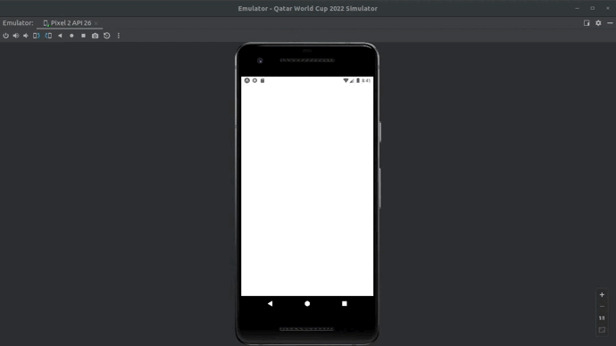

# World Cup 2022 Simulator
App simulator of Qatar world cup 2022. 

App Built with react native which simulates group stage and playoffs of 2022 World Cup. 

# About this Project

This app is build with **React Native** and **Expo**.

# Getting Started

**Prerequisites**

To run this project, you'll need to have *npm* installed.

**Installing**

To install the npm, run this on terminal:

	$ sudo apt install nodejs
	$ sudo apt install npm
	
You also need to install expo on your system with:	
	
	$ npm install expo-cli --global
	
You can read the Expo documentation and install from [here](https://expo.dev/).

After that, clone this Repository:

    $ git clone https://github.com/awcasella/World-Cup-2022-Sinulator.git

You need to set a virtual (emulator on Android Studio) or physical smartphone device.

Change to the root directory of the project:
    
    $ cd World-Cup-2022-Sinulator
    
Install the dependencies:

    $ npm start
    
And start the application with:

    $ expo start
